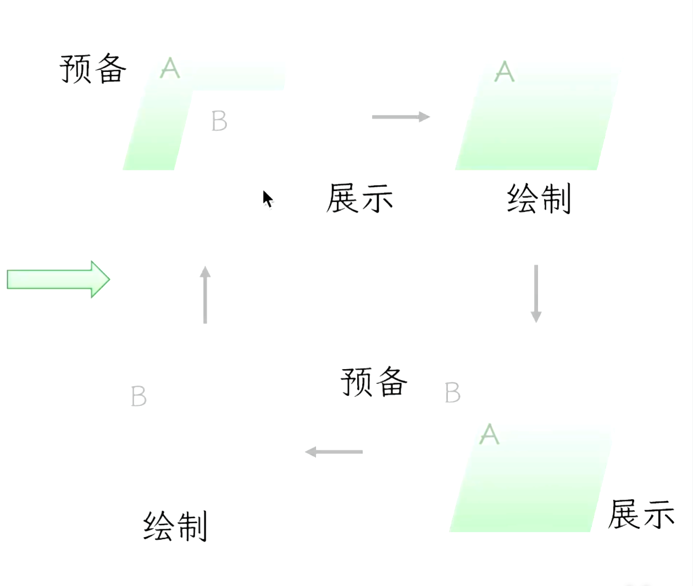
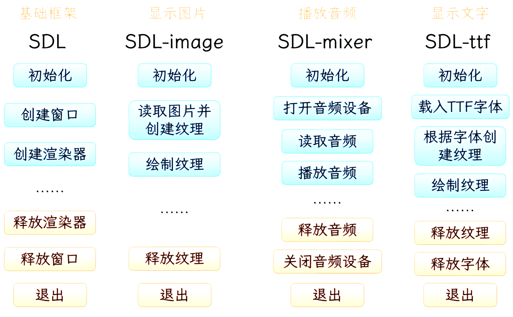

# 游戏开发常识

## 2D游戏坐标系统

左上角为原点，向右、向下为正向

## SDL基本流程
1. SDL初始化
2. 创建窗口
3. 创建渲染器
4. do something
5. 回收资源

```C++
    //1. SDL初始化
    if(SDL_Init(SDL_INIT_EVERYTHING) != 0){
        std::cerr << "SDL_Init Error: " << SDL_GetError() << std::endl;
        return 1;
    }

    //2. 创建窗口
    SDL_Window* pWindow = SDL_CreateWindow("Hello", 100, 100, 800, 600, SDL_WINDOW_SHOWN);

    //3. 创建渲染器
    SDL_Renderer* pRenderer = SDL_CreateRenderer(pWindow, -1, SDL_RENDERER_ACCELERATED);


    //4. 渲染
    SDL_RenderClear(pRenderer);
    SDL_RenderPresent(pRenderer);

    //5. 清理并退出
    SDL_DestroyRenderer(pRenderer);
    SDL_DestroyWindow(pWindow);
    SDL_Quit();
    return 0;
```

## 渲染原理

SDL有两个画板
预备画板A，展示画板B，在A画板绘制，然后展示到B画板




**实例**
```C++
    //SDL初始化
    if(SDL_Init(SDL_INIT_EVERYTHING) != 0){
        std::cerr << "SDL_Init Error: " << SDL_GetError() << std::endl;
        return 1;
    }

    //创建窗口
    SDL_Window* pWindow = SDL_CreateWindow("Hello", 100, 100, 800, 600, SDL_WINDOW_SHOWN);

    //创建渲染器
    SDL_Renderer* pRenderer = SDL_CreateRenderer(pWindow, -1, SDL_RENDERER_ACCELERATED);

    //图片初始化
    if(IMG_Init(IMG_INIT_JPG | IMG_INIT_PNG) != (IMG_INIT_JPG | IMG_INIT_PNG)){
        std::cerr << "IMG_Init Error: " << IMG_GetError() << std::endl;
        return 1;
    }

    //加载图片纹理
    SDL_Texture* pTexture = IMG_LoadTexture(pRenderer, "assets/image/bg.png");

    //音乐初始化
    if(Mix_OpenAudio(44100, MIX_DEFAULT_FORMAT, 2, 2048) < 0){
        std::cerr << "Mix_Init Error: " << Mix_GetError() << std::endl;
        return 1;
    }

    //加载音乐
    Mix_Music* pMusic = Mix_LoadMUS("assets/music/06_Battle_in_Space_Intro.ogg");
    if(pMusic == NULL){
        std::cerr << "Mix_LoadMUS Error: " << Mix_GetError() << std::endl;
        return 1;
    }

    //播放音乐
    Mix_PlayMusic(pMusic, -1);

    //SDL_ttf初始化
    if(TTF_Init() != 0){
        std::cerr << "TTF_Init Error: " << TTF_GetError() << std::endl;
        return 1;
    }
    
    //加载字体
    TTF_Font* pFont = TTF_OpenFont("assets/font/VonwaonBitmap-12px.ttf", 24);
    if(pFont == NULL){
        std::cerr << "TTF_OpenFont Error: " << TTF_GetError() << std::endl;
        return 1;
    }

    //创建文字纹理
    SDL_Surface* pTextSurface = TTF_RenderUTF8_Solid(pFont, "Hello, World!", {0, 0, 0, 255});
    SDL_Texture* pTextTexture = SDL_CreateTextureFromSurface(pRenderer, pTextSurface);
    if(pTextTexture == NULL){
        std::cerr << "SDL_CreateTextureFromSurface Error: " << SDL_GetError() << std::endl;
        return 1;
    }

    //渲染
    while(true){
        SDL_Event event;
        if(SDL_PollEvent(&event)){
            if(event.type == SDL_QUIT){ //退出事件
                break;
            }
        }

        // 清空画板 
        SDL_RenderClear(pRenderer);
        // 绘制长方形
        SDL_Rect rect = {100, 100, 200, 200};
        //设置画笔颜色（renderer, R, G, B, A） 蓝色，注意清屏会使用画笔颜色进行清空
        SDL_SetRenderDrawColor(pRenderer, 0, 0, 255, 255);  
        SDL_RenderFillRect(pRenderer, &rect);
        SDL_SetRenderDrawColor(pRenderer, 255, 255, 255, 255); //还原画笔颜色

        //绘制图片
        SDL_Rect dstRect = {300, 300, 200, 200};
        SDL_RenderCopy(pRenderer, pTexture, NULL, &dstRect);
        //绘制文字
        SDL_Rect textRect = {150, 150, pTextSurface->w, pTextSurface->h};
        SDL_RenderCopy(pRenderer, pTextTexture, NULL, &textRect);   
        // 更新屏幕展示
        SDL_RenderPresent(pRenderer);
        
    }

    //清理图片资源
    SDL_DestroyTexture(pTexture);
    IMG_Quit();
    //清理音乐资源
    Mix_FreeMusic(pMusic);
    Mix_CloseAudio();
    Mix_Quit();
    //清理文字资源
    SDL_FreeSurface(pTextSurface);
    SDL_DestroyTexture(pTextTexture);
    TTF_CloseFont(pFont);
    TTF_Quit();
    //清理并退出
    SDL_DestroyRenderer(pRenderer);
    SDL_DestroyWindow(pWindow);
    SDL_Quit();
```