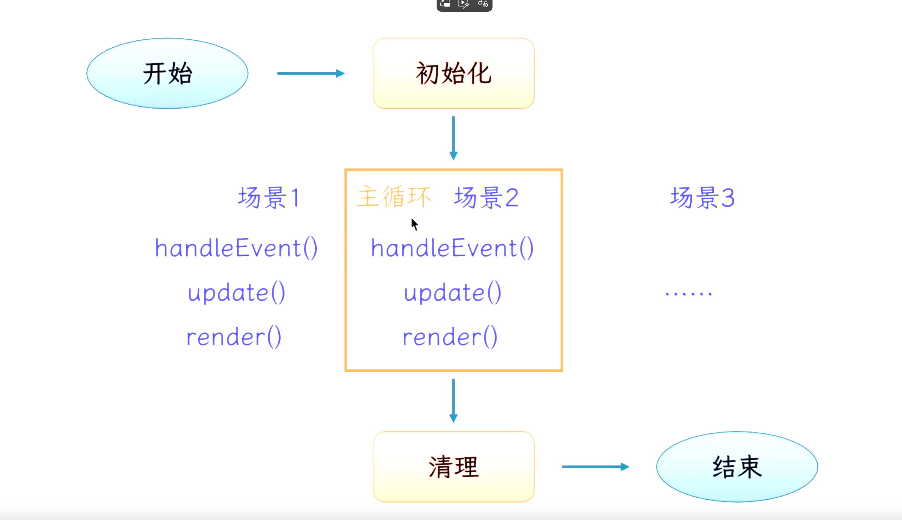
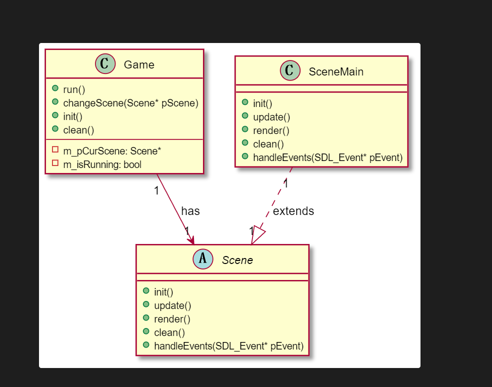

# 游戏开发框架

## 基本流程

**类图关系**

Game主类负责整个游戏控制
Scene类负责一个场景的控制，资源加载，渲染，交互等等

## 主循环

### 帧率控制

每一帧耗费时间 x 设定速度 = 与帧率无关的速度

主循环记录开始时间start
记录结束时间
计算（end - start）与frameTime时差并等待

 ## 玩家控制

### 移动
 方向控制，键盘监听，速度与位移

 ### 发射子弹

 有cd时间：该属性跟随玩家
 子弹的运动管理：使用std:list，每一帧遍历更新，render进行绘制
 子弹的生命周期（内存管理）

 关于文件读取的问题，由于是个开销比较大的工作，一般情况下是在一开始就全部读进去